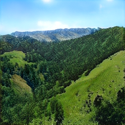
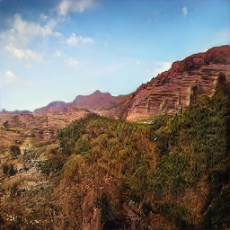
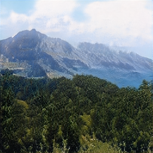
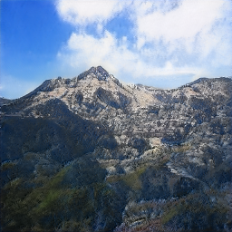
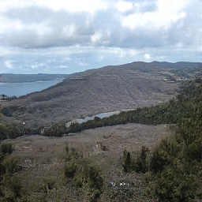
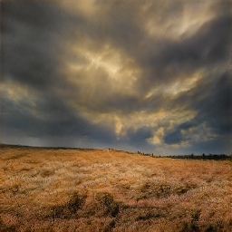
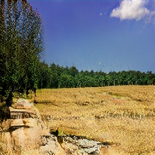
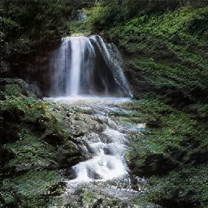
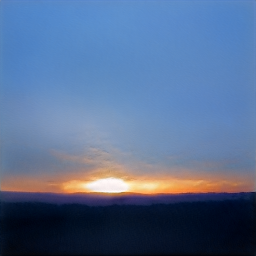

# Landscapes GAN - 256x256

This is a generative adversarial neural network I trained to generate photos of landscapes at 256x256 resolution. Preview photos are 
available along with sample progression photos from the training process. StyleGAN2-ada-pytorch was used to train on my own custom 
landscape data set. I used a script that uses Flickr's API to crawl through the image database and download photos that 
match a specified keyword (in this case the keyword was 'landscapes'). The image set that I collected will be linked below.
I trained this network around 2x longer than my 
[Flowers GAN](https://github.com/dudebroSW/pretrained-gan-flowers-256), but I also wanted to test StyleGAN2's 
ability to resume from a previously trained .pkl so there were multiple points in the training process that I stopped 
training and started up again from the last saved .pkl file. As a result, I haven't included the multiple folders that 
include the log data (I may upload them soon). Videos that I have created using the trained network are below. The 
.pkl file for this network is also included below in case anyone is interested in generating their own photos of 
landscapes.

Links:

* [Progression video of the training process on this data set](https://youtu.be/-Ov-SSFxrQ0)
* [Latent vector walk video #1](https://youtu.be/EJpfjA1vU4M)
* [Latent vector walk video #2](https://youtu.be/v37l-sQ1TXk)
* [Download link to my own custom landscape dataset used for training](https://github.com/dudebroSW/pretrained-gan-landscapes-256/releases/download/v1.0/landscapes-img-set-256.zip)
* [Download link to the landscapes .pkl file](https://github.com/dudebroSW/pretrained-gan-landscapes-256/releases/download/v1.0/landscapes-256-trained.pkl)
